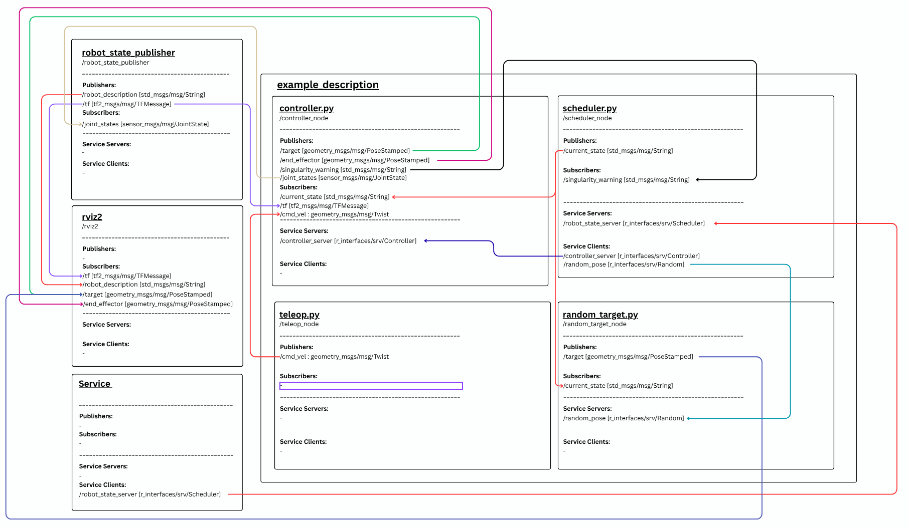
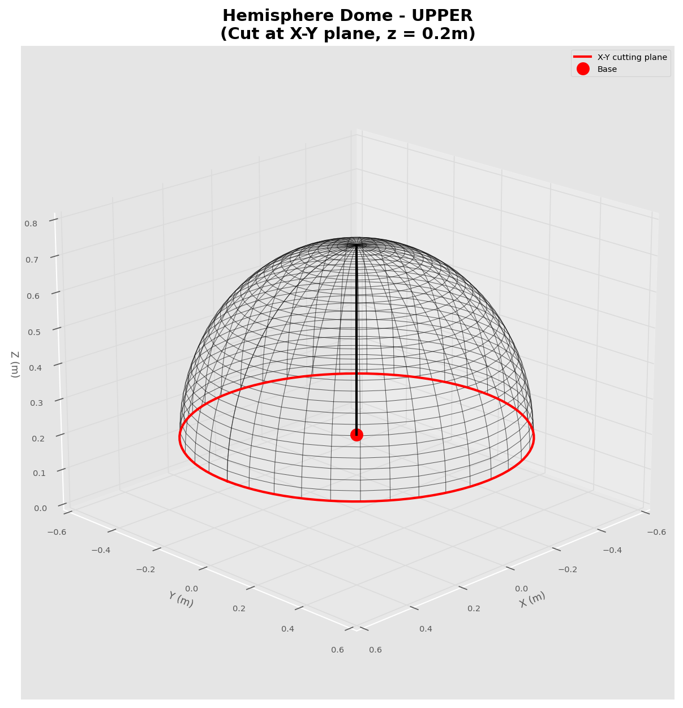

# LAB 4: 3R Robot Kinematics Control System

## System Overview

This project implements a complete control system for a 3-DOF robotic arm with three operational modes:
1. **Inverse Kinematics (IK) Mode** - Move to specific target positions
2. **Teleoperation (TELEOP) Mode** - Manual velocity control in two reference frames
3. **Automatic (AUTO) Mode** - Continuous movement to random workspace positions

## System Architecture




### Node Communication

**Node:**
- `controller_node`     - Handles the core mathematics and motion execution.
- `scheduler_node`      - Acts as a Finite State Machine (FSM) to manage the robot's operating modes.
- `teleop_node`         - A keyboard interface for the user.
- `random_target_node`  - Used specifically for the AUTO mode.
- `work_space.py`       - Find Workspace of Robot

**Topics:**
- `/current_state` (String) - Current robot state (IDLE/IK/TELEOP_G/TELEOP_F/AUTO)
- `/target` (PoseStamped) - Target position for visualization in RVIZ2
- `/end_effector` (PoseStamped) - Current end effector position for RVIZ2
- `/cmd_vel` (Twist) - Velocity commands from teleop keyboard
- `/joint_states` (JointState) - Joint positions for robot visualization
- `/singularity_warning` (String) - Singularity detection warnings

**Services:**
- `robot_state_server` (Scheduler) - State management service
- `controller_server` (Controller) - Mode switching and target setting
- `random_pose` (Random) - Random position generation for AUTO mode

## Installation

[Install ROS 2 packages](https://docs.ros.org/en/humble/Installation/Ubuntu-Install-Debs.html)

**Install dependencies**

```bash
pip3 install roboticstoolbox-python
```

**Go somewhere like your home directory and clone this package.**

```bash
git clone -b LAB4 https://github.com/natthaphxt/FRA502-LAB-6677.git
```
**then build ros2 workspace**
```bash
cd FRA502-LAB-6677
colcon build
source install/setup.bash
```


## How to Run

### Step 1: Launch the Main System

Open a terminal and run:
```bash
ros2 launch example_description robot_control.launch.py
```
If cannot run you must dom this before and used upper command:
```bash
cd FRA502-LAB-6677
colcon build
source install/setup.bash
```

**This will start:**
- RVIZ2 (visualization)
- robot_state_publisher (TF management)
- scheduler.py (state manager)
- random_target.py (random position generator)
- controller.py (main controller)

**Wait for all nodes to initialize (~3-5 seconds)**

### Step 2: Launch Teleop Keyboard Interface

Open a **NEW terminal** and run:
```bash
ros2 run example_description teleop.py
```
If cannot run you must dom this before and used upper command:
```bash
cd FRA502-LAB-6677
colcon build
source install/setup.bash
```
You should see the control menu:
```
---------------------------
3R Robot Teleop Keyboard Control
---------------------------
Control Modes:
  1: Inverse Kinematics Mode
  2: Teleoperation Global Frame
  3: Teleoperation End-Effector Frame
  4: Auto Mode
  0: IDLE/Stop

Movement keys (for Teleoperation):
        w
   a    s    d     (x-y plane)

   q: up (+z)
   e: down (-z)

Speed Control:
   t/g: increase/decrease linear speed by 10%
   
CTRL-C to quit
---------------------------
```

## Usage Guide

### Mode 1: Inverse Kinematics (IK)

**Purpose:** Move end effector to a specific target position

**How to use:**
1. Press `1` or press `i` at any time
2. Enter target coordinates:
   ```
   Enter X coordinate (m): 0.3
   Enter Y coordinate (m): 0.0
   Enter Z coordinate (m): 0.35
   ```
3. **If target is reachable:**
   - Service returns `True`
   - Robot moves smoothly to target
   - Target marker appears in RVIZ2
   
4. **If target is unreachable:**
   - Service returns `False`
   - Robot stays in current position
   - Warning message displayed: "✗ Target REJECTED (No safe solution found)"

**Valid workspace:**
- Radial distance: 0.12m - 0.48m from base
- Height (Z): 0.28m - 0.50m
- All robot links must stay above ground (Z > 0.05m)

**Example targets:**
```bash
# Good targets (will work)
x=0.30, y=0.00, z=0.35  ✓
x=0.20, y=0.20, z=0.40  ✓
x=0.35, y=0.10, z=0.30  ✓

# Bad targets (will reject)
x=0.00, y=0.00, z=0.10  ✗ (too low)
x=0.60, y=0.00, z=0.30  ✗ (out of reach)
x=0.05, y=0.00, z=0.25  ✗ (too close to singularity)
```

### Mode 2: Teleoperation - Global Frame (TELEOP_G)

**Purpose:** Manual control with velocity relative to world/base frame

**How to use:**
1. Press `2` to enter TELEOP_G mode
2. Use movement keys:
   - `w` - Move forward (+X in world frame)
   - `s` - Move backward (-X in world frame)
   - `a` - Move left (+Y in world frame)
   - `d` - Move right (-Y in world frame)
   - `q` - Move up (+Z in world frame)
   - `e` - Move down (-Z in world frame)

3. Adjust speed:
   - `t` - Increase speed (+0.01 m/s)
   - `g` - Decrease speed (-0.01 m/s)

4. **Robot automatically stops 100ms after you release any key**

**Singularity Protection:**
- If robot approaches singularity:
  - Robot **STOPS immediately**
  - Terminal shows: "⚠️ SINGULARITY DETECTED - ROBOT STOPPED ⚠️"
  - Movement is disabled until you change mode

### Mode 3: Teleoperation - End Effector Frame (TELEOP_F)

**Purpose:** Manual control with velocity relative to end effector orientation

**How to use:**
1. Press `3` to enter TELEOP_F mode
2. Use same movement keys as TELEOP_G:
   - `w` - Move forward in end effector's +X direction
   - `s` - Move backward in end effector's -X direction
   - `a` - Move left in end effector's +Y direction
   - `d` - Move right in end effector's -Y direction
   - `q` - Move up in end effector's +Z direction
   - `e` - Move down in end effector's -Z direction

3. **Movement direction changes based on end effector orientation**

**Example:**
- If end effector is rotated 90°, pressing `w` moves sideways relative to base
- This allows intuitive control from the "robot's perspective"

### Mode 4: Automatic Mode (AUTO)

**Purpose:** Continuous automatic movement to random verified positions

**How to use:**
1. Press `4` to enter AUTO mode
2. Robot automatically:
   - Requests random position from `random_target.py`
   - Moves to position within 10 seconds
   - When target reached → generates new random target
   - Continues indefinitely until you press `0`

3. **10-Second Timeout:**
   - If target not reached within 10 seconds
   - Mode automatically returns to IDLE
   - Warning displayed: "AUTO mode TIMEOUT"

4. Press `0` to stop AUTO mode and return to IDLE

**Notes:**
- All random targets are **GUARANTEED reachable** (verified with IK)
- Targets avoid singularities (Jacobian determinant > 3e-3)
- All robot links maintain 5cm ground clearance

### Mode 0: IDLE

**Purpose:** Stop all movement

**How to use:**
- Press `0` at any time to return to IDLE state
- Robot stops all movement
- Safe mode for making changes

## Visualization in RVIZ2

When the system is running, you should see in RVIZ2:

1. **Robot Model** - 3-DOF arm moving in real-time
2. **Target Marker** (Red sphere) - Current target position
3. **End Effector Marker** (Green sphere) - Current end effector position
4. **TF Frames** - Coordinate frames for each link

**RVIZ2 Configuration:**
- Fixed Frame: `link_0`
- Add: `RobotModel`, `TF`, `Marker` displays
- Topics: `/target`, `/end_effector`

## Testing Commands

```bash
# Check all nodes are running
ros2 node list
# Expected: /controller_node, /random_node, /robot_scheduler_node, /teleop_jog_keyboard

# Check all services exist
ros2 service list | grep -E "(controller|scheduler|random)"
# Expected: /controller_server, /robot_state_server, /random_pose

# Check topics
ros2 topic list
# Expected: /current_state, /target, /end_effector, /cmd_vel, /joint_states

# Monitor current state
ros2 topic echo /current_state

# Monitor singularity warnings
ros2 topic echo /singularity_warning

# Monitor end_effector
ros2 topic echo /end_effector

```

## Find Workspace 
Open a NEW terminal and run:
```bash
ros2 run example_description work_space.py
```


## If you want to see end_effector Arrow 
You must to click :
1. add in rviz2
2. select by topic
3. click /end_effector/pose
4. click OK
